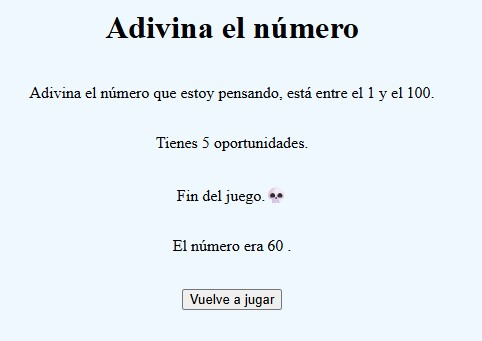

# Adivina el número - PHP
## Juego de adivinar el número aleatorio
Juego realizado en **PHP** en el que el usuario tiene cinco oportunidades para adivinar el número que ha pensado el ordenador.

Tendrás <ins>5 intentos</ins> para averiguar el número misterioso.

Dale ⭐ para más contenido!
